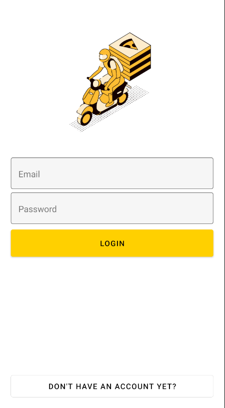
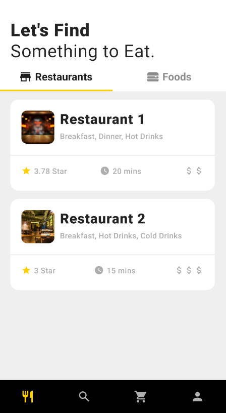
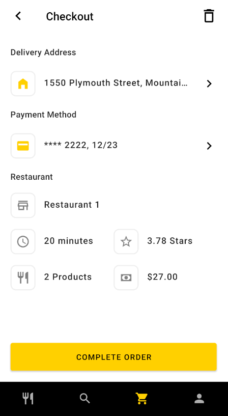
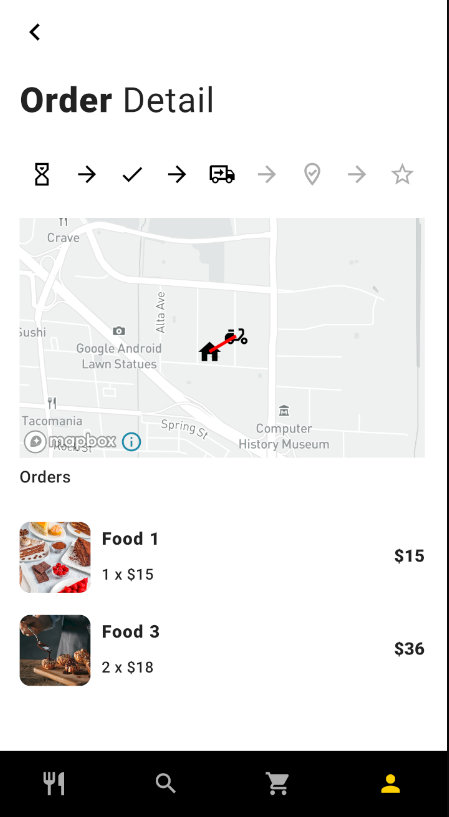

### React Native Delivery App - Delivr
###### (probably there is already a company with this name but i don't know what to call this app, open to ideas)


This repo contains a react native app and backend written in python with django-rest-framework.

#### User Types
---

There is 3 different user types which are user, restaurant and driver.

Register screen creates a user account, if you want to create restaurant or driver account you have to do it from backend, sorry 🤷🏻‍♂️

User account can browse or search through restaurants and foods, create an order, follow the order status and rate the restaurant, can add payment and address info.

Restaurant account can add new food, see the orders, change the order status and assign a driver to an order.

Driver account can see the assigned orders, send gps location and complete the order.

#### Installation

1- Create .env file which includes following information

```
db_name=""
db_user=""
db_pass=""
secret_key=''

# development settings
DEBUG=True
```

2- Make migrations

```
python3 manage.py migrate
```

3- Create Super User

```
python3 manage.py createsuperuser
```

4- Start the Server

It is best to start the server with local-ip so you connect through your phone in same wifi. Also you need to change the ip in ```api-fetch.js```  and ```use-fetch.js``` files.

```
python3 manage.py runserver local-ip:8080
```

Some Sample Screenshots

<p float="left">
  
   
</p>
<br/>
<p float="left">
  
   
</p>